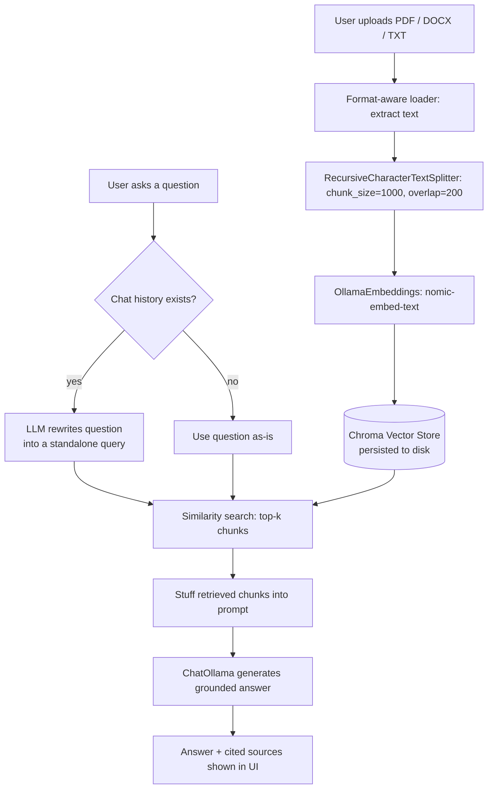

# Private Document Intelligence AI — Local RAG Chatbot

A fully local, privacy-preserving **Retrieval-Augmented Generation (RAG)** system that lets you chat with your own PDF, DOCX, and TXT documents. No document content or query ever leaves your machine — embeddings and generation both run through [Ollama](https://ollama.com) locally.

Built as a summer internship project to demonstrate a realistic, production-style RAG pipeline rather than a toy demo.

---

## Why this project

Most tutorial RAG chatbots stop at "upload a PDF, ask one question." This project pushes further into the parts that actually matter in real deployments:

- **Conversational memory** — follow-up questions ("what about its price?") are resolved against chat history before retrieval, not treated as unrelated queries.
- **Source citations** — every answer shows exactly which document and page it came from, so answers are verifiable, not just trusted.
- **Persistence** — the knowledge base survives app restarts (Chroma is disk-backed), instead of being rebuilt from scratch on every run.
- **Multi-document support** — index several PDF, DOCX, and TXT files into one knowledge base and query across all of them.
- **Operational resilience** — the app checks Ollama connectivity up front and fails with a clear, actionable message instead of a stack trace.
- **A feedback loop** — 👍/👎 on each answer gives a lightweight, visible measure of answer quality across a session.
- **Hybrid retrieval + reranking** — pure vector similarity search often misses exact keywords, numbers, or codes (e.g. "30 days", "SKU-1042") because they don't carry much semantic weight. This project combines BM25 keyword search with MMR-diversified vector search via an `EnsembleRetriever`, then re-scores the widened candidate pool with a cross-encoder (`cross-encoder/ms-marco-MiniLM-L-6-v2`) before the final top-k is sent to the LLM — the standard "retrieve many, rerank, keep few" pattern used in production RAG systems. Toggle either stage off in the sidebar to compare against a naive baseline.
- **Document management** — per-file size, page count, and upload time are tracked (persisted in `chroma_db/document_registry.json`), with the ability to remove a single document or clear everything.
- **Streaming answers** — tokens appear as they're generated instead of waiting for the full response.
- **Clean re-indexing** — re-uploading an already-indexed file replaces its chunks instead of duplicating them, so the knowledge base can't silently get biased toward whatever was indexed twice.

---

## Architecture



**Pipeline stages:**

| Stage | Component | Purpose |
|---|---|---|
| Ingestion | `PyPDFLoader`, `Docx2txtLoader`, `TextLoader` | Extracts text from PDF, DOCX, and TXT; PDFs preserve page numbers for citation |
| Chunking | `RecursiveCharacterTextSplitter` | Splits into ~1000-char overlapping chunks so context isn't cut mid-thought |
| Embedding | `nomic-embed-text` via Ollama | Converts chunks into vectors, entirely locally |
| Storage | `Chroma` (persistent) | Disk-backed vector index, survives restarts |
| Query rewriting | `ChatOllama` + history-aware retriever | Makes follow-up questions retrieval-ready |
| Retrieval | `EnsembleRetriever` (BM25 + Chroma/MMR) | Pulls the top-k most relevant chunks by both keyword and meaning |
| Generation | `ChatOllama` (llama3.2 by default) | Answers strictly from retrieved context, with instructions to be precise rather than vague |

---

## Project structure

```
RAG_Project/
├── app.py                     # Streamlit UI — orchestrates the pipeline
├── src/
│   ├── config.py               # All tunables in one place
│   ├── utils.py                 # Ollama health checks, formatting helpers
│   ├── document_processor.py   # PDF loading + chunking
│   ├── vectorstore.py          # Persistent Chroma management
│   └── rag_chain.py            # History-aware conversational RAG chain
├── requirements.txt
├── .gitignore
└── README.md
```

Splitting the original single 108-line script into modules by responsibility (ingestion / storage / chain / UI) makes each piece independently testable and easy to explain in a review — a deliberate software-engineering choice, not just tidiness.

---

## Setup

### 1. Install Ollama and pull the required models
```bash
# Install Ollama: https://ollama.com/download
ollama pull llama3.2
ollama pull nomic-embed-text
ollama serve   # starts the local model server on :11434
```

### 2. Install Python dependencies
```bash
python -m venv .venv
source .venv/bin/activate      # Windows: .venv\Scripts\activate
pip install -r requirements.txt
```

### 3. Run the app
```bash
streamlit run app.py
```
Open the URL Streamlit prints (typically `http://localhost:8501`).

---

## Using it

1. **Upload** one or more PDF, DOCX, or TXT files in the sidebar.
2. Click **Index Document(s)** — you'll see the chunk count once embedding finishes.
3. **Ask questions** in the chat box. Follow-up questions are understood in context.
4. Expand **📚 Sources** under any answer to see exactly which document/page it drew from. PDF citations include page numbers; DOCX and TXT citations identify the source document.
5. Rate answers with 👍/👎 — session accuracy shows in the sidebar.
6. Use **Clear Knowledge Base** to wipe indexed documents, or **Clear Chat** to reset the conversation without losing the index.

### Tuning (sidebar)
- **LLM model** — swap between any locally pulled Ollama model.
- **Temperature** — 0 for factual/deterministic answers (recommended for document QA).
- **Chunks retrieved (k)** — more chunks = broader context but more noise; 3–5 is a good default.
- **Chunk size / overlap** (advanced) — larger chunks preserve more context per retrieval but reduce precision.

---

## Design decisions worth knowing for a viva

- **Why Chroma over FAISS?** Chroma has native persistence and metadata filtering out of the box, which this project relies on for multi-document citation.
- **Why history-aware retrieval instead of just appending chat history to the prompt?** Appending history to the *generation* prompt doesn't help the *retriever* find the right chunks for a vague follow-up question. Rewriting the query first fixes retrieval, not just phrasing.
- **Why `temperature=0` by default?** Document QA should be deterministic and grounded — creativity here increases hallucination risk. The setting is still exposed for experimentation.
- **Why local models via Ollama instead of an API?** Keeps the system usable with sensitive/enterprise documents (the stated use case) with zero data leaving the device, and zero API cost.

---

## Testing & evaluation

- **Unit tests** (`tests/`, 58 tests): `pip install -r requirements-dev.txt && pytest`. Covers ingestion, chunking, the persistence/dedup logic in the vector store, reranker fallback behavior, and retriever wiring — with Ollama/Chroma/the cross-encoder mocked at clean boundaries so the suite runs in under a second with no external services.
- **Automated retrieval + answer-quality evaluation** (`eval/`): a 10-question labeled test set grounded in the sample document, scored on Hit Rate@k, MRR, and keyword coverage. Run `ollama serve`, then `python eval/index_sample_doc.py`, then `python eval/evaluate.py --compare` to see hybrid+reranker performance against a naive vector-only baseline, side by side. See `CHANGES.md` for details.

## Known limitations & possible extensions

- No authentication/multi-user isolation — fine for a local single-user tool, would need per-user collections for a shared deployment.
- Reranking uses a small MiniLM cross-encoder for speed on CPU; swapping in `BAAI/bge-reranker-base` (see `src/reranker.py`) trades speed for a bit more accuracy if you have GPU headroom.
- The eval set (`eval/qa_testset.json`) currently covers one sample document with 10 questions — a real research-grade write-up would extend this to your full corpus with more questions per category, and optionally an LLM-as-judge faithfulness score alongside the keyword-coverage proxy used now.

---

## Tech stack

`Python` · `Streamlit` · `LangChain` · `Chroma` · `Ollama` (`llama3.2`, `nomic-embed-text`)
## Out Put


